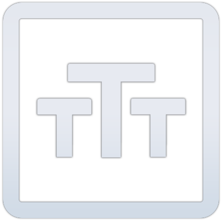

<h1></h1>

# sbox TTT

TTT is aimed to be the spiritual successor of [TTT](https://ttt.badking.net/) but developed for [s&box](https://sbox.facepunch.com/news). The goal of this project is to replicate the vanilla TTT experience with some quality of life thrown in.

## LICENSE

Please note that anything inside of `/models/`, `/materials/`, and `/sounds/` does NOT fall under the GPL-3.0 License. These are compiled files which I am forced to distribute whenever a client downloads the game (therefore they might as well exist in the repo). I do have permission to use everything found within those folders. Everything else outside of those folders are is GPL-3.0 License, so go wild.

## CONTRIBUTING

If you'd like to contribute, please check out our [document](https://github.com/mzegar/sbox-TTT/blob/main/CONTRIBUTING.md) which runs through the process of how to setup and contribute to our repo.

## DEVELOPMENT

You can checkout devblog update videos on my [YouTube channel](https://www.youtube.com/channel/UCk2IAm1j9o_3GWrqf537gNg).

Latest video: https://youtu.be/G9ghFjVx-Wc

## CREDITS

- [Contributors](https://github.com/mzegar/sbox-TTT/graphs/contributors)
- [Pukes](https://twitter.com/ILikeADaArt) - Equipment models
